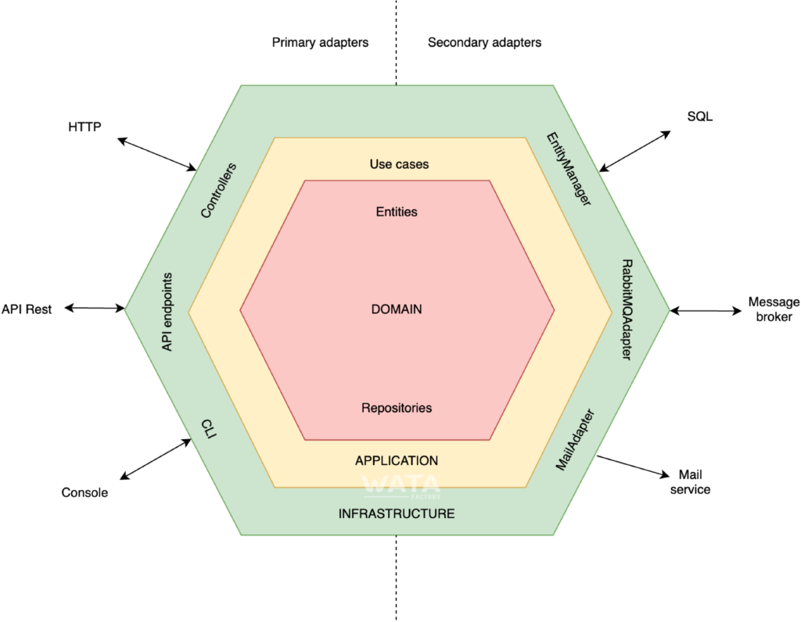

## MallPlaza Parking Service

This is a microservice made in Micronaut 4.0.0 that provides an API that allows manage vehicles in a parking lot.

This implementation contains a hexagonal architecture and it contains an embedded database H2.

# Architecture Overview

The source code is separated into four modules:

* `domain` - contains the domain model
* `application` - contains the domain services and the ports of the hexagon(repositories, services and use cases)
* `adapters` - contains the REST, GraphQL and Persistence adapters

The following diagram shows the hexagonal architecture of the application along with the source code modules:

# Compilation and start microservice

For build and run this microservice, you need execute the following commands:

### Compilation

> gradle clean assemble

> gradle build

### Bootstrap the microservice

With java
> java -jar .\ms-java-mallplaza-0.1-all.jar

With Docker
> docker run -p 8080:8080 ms-java-mallplaza:latest

# Rest API

The following services are responsible to manage information about vehicles and owners implicitly:

## Create vehicle

>  curl --location 'http://localhost:8080/parking/vehicle/MNI335' \
--header 'Content-Type: application/json' \
--data '{
"patent" : "MNU123",
"type": "CAR",
"color": "Red",
"model": "2024",
"vehicleOwner": {
"document" : "RUT123135-5",
"name" : "Andres",
"lastname": "Doe"
}
}'

## Update vehicle

> curl --location --request PUT 'http://localhost:8080/parking/vehicle/MNI335' \
--header 'Content-Type: application/json' \
--data '{
"patent" : "MNU123",
"type": "CAR",
"color": "Blue",
"model": "2024",
"vehicleOwner": {
"document" : "RUT123135-4",
"name" : "Andres Felipe",
"lastname": "Hinestroza"
}
}'

## Get vehicle by patent

> curl --location 'http://localhost:8080/parking/vehicle/MNU123'

## Delete vehicle

> curl --location --request DELETE 'http://localhost:8080/parking/vehicle/MNU123'
